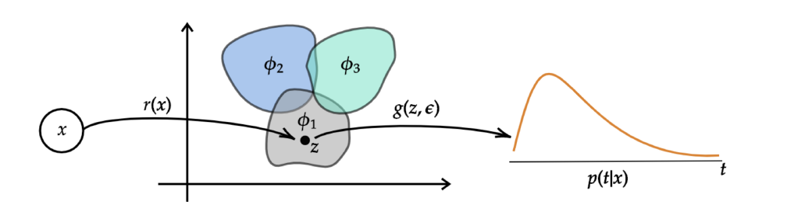
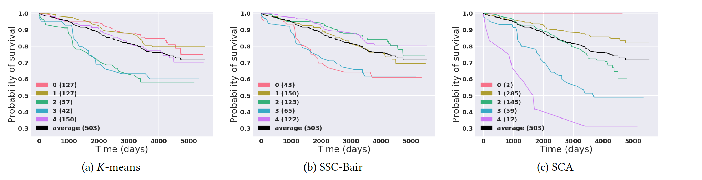

# Survival Cluster Analysis (ACM CHIL 2020)

This repository contains the TensorFlow code to replicate experiments in our paper [Survival Cluster Analysis](https://arxiv.org/abs/2003.00355) accepted at ACM Conference on Health, Inference, and Learning (ACM CHIL) 2020:
```latex
@inproceedings{chapfuwa2020survival, 
  title={Survival Cluster Analysis},
  author={Paidamoyo Chapfuwa and Chunyuan Li and Nikhil Mehta and Lawrence Carin and Ricardo Henao},
  booktitle={ACM Conference on Health, Inference, and Learning},
  year={2020}
}
```
 
## Model



Illustration of Survival Clustering Analysis (SCA).
The latent space has a mixture-of-distributions structure, illustrated
as three mixture components. Observation
`x` is mapped into its latent representation `z` via a deterministic
encoding, which is then used to
stochastically predict (via sampling) the time-to-event `p(t|x)`.



Cluster-specific Kaplan-Meier survival profiles for three clustering methods on the SLEEP dataset. 
Our model (SCA) can identify high-, medium- and low-risk individuals. Demonstrating the
need to account for time information via a non-linear transformation of covariates when clustering survival datasets.

## Prerequisites
The code is implemented with the following dependencies:

- [Python  3.6.4](https://github.com/pyenv/pyenv)
- [TensorFlow 1.8.0]( https://www.tensorflow.org/)
- Additional python packages can be installed by running:   

```
pip install -r requirements.txt
```

## Data
We consider the following datasets:

- [SUPPORT](http://biostat.mc.vanderbilt.edu/wiki/Main/DataSets)
- [Flchain](https://vincentarelbundock.github.io/Rdatasets/doc/survival/flchain.html)
- [SEER](https://seer.cancer.gov/)
- [SLEEP](https://sleepdata.org/datasets/shhs): A subset of the Sleep Heart Health Study
(SHHS), a multi-center cohort study implemented by the National
Heart Lung & Blood Institute to determine the cardiovascular
and other consequences of sleep-disordered breathing.
- [Framingham](https://framinghamheartstudy.org/): A subset (Framingham Offspring) of the longitudinal study of heart
disease dataset, initially for predicting 10-year risk for future
coronary heart disease (CHD).
- EHR: A large study from Duke University Health System centered around inpatient visits due to comorbidities in patients with Type-2 diabetes.

 For convenience, we provide pre-processing scripts of all datasets (except EHR and [Framingham](https://framinghamheartstudy.org/)). In addition, the [*data*](./data) directory contains downloaded [Flchain](https://vincentarelbundock.github.io/Rdatasets/doc/survival/flchain.html) and [SUPPORT](http://biostat.mc.vanderbilt.edu/wiki/Main/DataSets) datasets.

## Model Training

Please modify the train arguments with the chosen:

- `dataset` is set to one of the three public datasets `{flchain, support, seer, sleep}`, the default is `support`
-  K cluster uppper bound `n_clusters`, the default is `25`
- Dirichlet process concetration parameter `gamma_0` selected from `{2, 3, 4, 8}`, default is `2`

* To train **SCA** run [train.py](./train.py) 

```
 python train.py --dataset support --n_clusters 25 --gamma_0 2
```

* The hyper-parameters settings can be found at [**configs.py**](./configs.py)


## Metrics and Visualizations

Once the networks are trained and the results are saved, we extract the following key results: 

* Training and evaluation metrics are logged in **model.log**
* Epoch based cost function plots can be found in the [**plots**](./plots) directory
* Numpy files to generate calibration and cluster plots are saved in  [**matrix**](./matrix) directory
* Run the [Calibration.ipynb](./Calibration.ipynb) to generate calibration results and [Clustering.ipynb](./Clustering.ipynb) for clustering results

## Acknowledgments
This work leverages the calibration framework from [SFM](https://ieeexplore.ieee.org/document/9244076) and the accuracy objective from [DATE](https://arxiv.org/pdf/1804.03184.pdf). Contact [Paidamoyo](https://github.com/paidamoyo) for issues relevant to this project.
